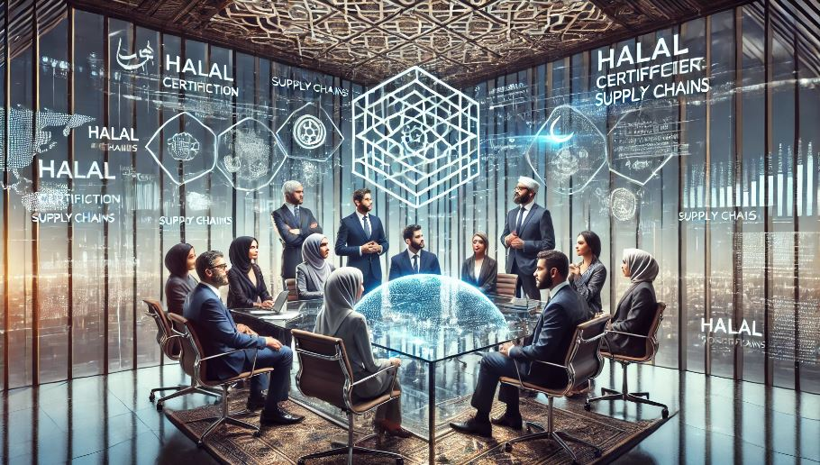

# 🚀 HalalChain Marketplace – Core Team & Advisory Board

***

## The success of **HalalChain Marketplace** is driven by a diverse team of **blockchain experts, halal industry specialists, AI developers, and fintech innovators**, alongside a strong advisory board comprising **scholars, regulatory experts, and business leaders**.

***

<figure><figcaption></figcaption></figure>

## 🔹 Core Leadership Team

#### **1. Chemmara Enterprise – Founder & Chief Executive Officer (CEO)**

📌 **Visionary Leader & Blockchain Strategist**\
📌 Expert in **MASaaS (Managed Software as a Service), SME automation & AI-driven marketplaces**\
📌 Drives **HalalChain’s blockchain integration, tokenomics, and strategic partnerships**\
📌 Advocates for **Shariah-compliant digital economies & decentralized eCommerce models**

***

#### **2. \[Co-Founder Name] – Chief Strategy Officer (CSO)**

📌 Oversees **global expansion, investor relations, and ecosystem development**\
📌 Leads **business model innovations for halal B2B, B2C, and C2C eCommerce**\
📌 Works with **tokenomics experts to optimize 💲MyHalal token utility in DeFi & cross-border trade**

***

#### **3. \[Co-Founder Name] – Chief Operating Officer (COO)**

📌 Manages **day-to-day operations, vendor onboarding & halal compliance execution**\
📌 Implements **AI-powered halal verification & NFT-based certification workflows**\
📌 Ensures **operational efficiency, risk management & customer experience optimization**

***

#### **4. \[CTO Name] – Chief Technology Officer (CTO)**

📌 Leads **blockchain architecture, smart contracts, and IoT-enabled traceability**\
📌 Develops **Google Cloud Pub/Sub automation for real-time halal supply chain tracking**\
📌 Oversees **security, scalability & interoperability between blockchain and halal certification bodies**

***

#### **5. \[CMO Name] – Chief Marketing Officer (CMO)**

📌 Develops **Islamic fintech marketing strategies & halal brand positioning**\
📌 Drives **💲MyHalal token adoption through global partnerships & influencer collaborations**\
📌 Implements **community-driven DeFi & NFT campaigns to engage SMEs & consumers**

***

#### **6. \[Head of Compliance Name] – Halal Regulatory & Certification Expert**

📌 Works with **JAKIM, MUI, ESMA, and other global halal authorities**\
📌 Ensures **Shariah-compliance across all blockchain transactions & tokenomics models**\
📌 Develops **smart contract-based halal verification for supply chain integrity**

***

### **🔹 Strategic Advisory Board**

#### **1. \[Advisor Name] – Islamic DeFi & Tokenomics Expert**

📌 Develops **Shariah-compliant DeFi staking, lending, and yield farming models**\
📌 Advises on **💲MyHalal token liquidity pools & halal investment frameworks**\
📌 Helps structure **decentralized finance (DeFi) solutions for Islamic SMEs & startups**

***

#### **2. \[Advisor Name] – AI & IoT-Powered Halal Verification Specialist**

📌 Designs **AI-powered halal certification auditing for product authenticity**\
📌 Leads **IoT device integration for halal supply chain automation**\
📌 Implements **blockchain-based tracking for halal food, pharmaceuticals & cosmetics**

***

#### **3. \[Advisor Name] – Global Halal Supply Chain & Logistics Expert**

📌 Helps **integrate blockchain for halal food traceability & logistics efficiency**\
📌 Optimizes **cross-border halal trade compliance using decentralized ledgers**\
📌 Works on **real-time AI monitoring of halal storage, transportation, and delivery**

***

#### **4. \[Advisor Name] – Shariah Compliance & Ethical Finance Scholar**

📌 Advises on **Shariah-compliant smart contracts & tokenization models**\
📌 Ensures **ethical governance of HalalChain’s decentralized economy**\
📌 Collaborates with **Islamic finance bodies for regulatory approvals**

***

### **🛠 Innovation Pillars: How the Team is Transforming Halal eCommerce**

1️⃣ **Blockchain-Powered Halal Ecosystem**

* **Smart contracts for halal B2B, B2C & C2C commerce**
* **NFT-based halal certificates for food, cosmetics & pharmaceuticals**
* **💲MyHalal token for seamless halal payments & cross-border trade**

2️⃣ **AI & IoT-Driven Halal Compliance**

* **AI-based halal certification verification**
* **IoT sensors for real-time product traceability**
* **Automated fraud detection & Shariah audit mechanisms**

3️⃣ **DeFi for Islamic SMEs & Startups**

* **Halal-compliant staking, yield farming & liquidity pools**
* **Decentralized crowdfunding & profit-sharing investment models**
* **Tokenized halal real estate & ethical Islamic finance solutions**

***

### **🚀 Join the HalalChain Movement!**

📌 **Looking for blockchain developers, halal experts, and fintech investors**\
📌 **Partner with us to revolutionize halal commerce using AI, DeFi & NFTs**\
📩 **Get in touch to be part of the future of Shariah-compliant digital trade**

***

