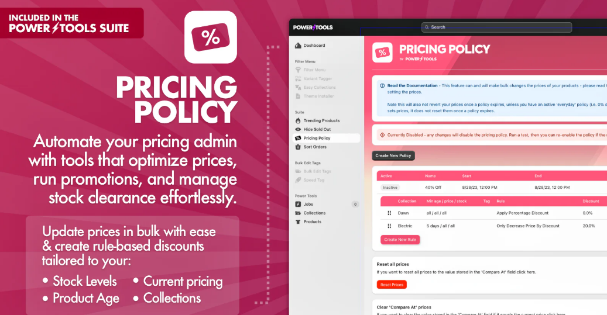

# Supply Chain Management (SCM)

***

***

<figure><figcaption></figcaption></figure>

## Power Tools Suite&#x20;


Boost your store with all your Power Tools Apps in one! Save time and automate your Store!



***


#### **Halal Supply Chain Analytics**

**Features:**

✅ Real-time **data ingestion** from IoT sensors (e.g., temperature, humidity)\
✅ **Blockchain-backed traceability** using a simulated ledger\
✅ **Automated alerts** for Halal compliance violations\
✅ **Analytics & reporting** for supply chain optimization

***

#### **1. Maven `pom.xml` Dependencies**

```xml
<project xmlns="http://maven.apache.org/POM/4.0.0"
         xmlns:xsi="http://www.w3.org/2001/XMLSchema-instance"
         xsi:schemaLocation="http://maven.apache.org/POM/4.0.0 http://maven.apache.org/xsd/maven-4.0.0.xsd">
    <modelVersion>4.0.0</modelVersion>

    <groupId>com.halalchain</groupId>
    <artifactId>halal-supply-chain</artifactId>
    <version>1.0.0</version>
    <packaging>jar</packaging>

    <dependencies>
        <!-- Spring Boot Dependencies -->
        <dependency>
            <groupId>org.springframework.boot</groupId>
            <artifactId>spring-boot-starter-web</artifactId>
        </dependency>

        <dependency>
            <groupId>org.springframework.boot</groupId>
            <artifactId>spring-boot-starter-data-mongodb</artifactId>
        </dependency>

        <!-- Apache Kafka for real-time data ingestion -->
        <dependency>
            <groupId>org.springframework.kafka</groupId>
            <artifactId>spring-kafka</artifactId>
        </dependency>

        <!-- Jackson for JSON parsing -->
        <dependency>
            <groupId>com.fasterxml.jackson.core</groupId>
            <artifactId>jackson-databind</artifactId>
        </dependency>

        <!-- Lombok for reducing boilerplate code -->
        <dependency>
            <groupId>org.projectlombok</groupId>
            <artifactId>lombok</artifactId>
            <scope>provided</scope>
        </dependency>

        <!-- Spring Boot Starter Test -->
        <dependency>
            <groupId>org.springframework.boot</groupId>
            <artifactId>spring-boot-starter-test</artifactId>
            <scope>test</scope>
        </dependency>
    </dependencies>

    <build>
        <plugins>
            <plugin>
                <groupId>org.springframework.boot</groupId>
                <artifactId>spring-boot-maven-plugin</artifactId>
            </plugin>
        </plugins>
    </build>
</project>
```

***

#### **2. IoT Sensor Data Model (`SupplyChainData.java`)**

```java
package com.halalchain.model;

import lombok.Data;
import org.springframework.data.annotation.Id;
import org.springframework.data.mongodb.core.mapping.Document;

@Data
@Document(collection = "supply_chain_data")
public class SupplyChainData {
    @Id
    private String id;
    private String productId;
    private double temperature;
    private double humidity;
    private String location;
    private String status; // "HALAL_COMPLIANT" or "VIOLATION"
    private long timestamp;
}
```

***

<figure><figcaption><p>Huawei AppGallery</p></figcaption></figure>



#### **3. Kafka Producer - Simulating IoT Sensor Data (`SupplyChainProducer.java`)**

```java
package com.halalchain.kafka;

import com.halalchain.model.SupplyChainData;
import com.fasterxml.jackson.core.JsonProcessingException;
import com.fasterxml.jackson.databind.ObjectMapper;
import org.springframework.kafka.core.KafkaTemplate;
import org.springframework.stereotype.Service;
import java.util.Random;

@Service
public class SupplyChainProducer {
    private final KafkaTemplate<String, String> kafkaTemplate;
    private final ObjectMapper objectMapper = new ObjectMapper();
    private final Random random = new Random();
    
    public SupplyChainProducer(KafkaTemplate<String, String> kafkaTemplate) {
        this.kafkaTemplate = kafkaTemplate;
    }
    
    public void sendSensorData(String productId) throws JsonProcessingException {
        SupplyChainData data = new SupplyChainData();
        data.setProductId(productId);
        data.setTemperature(2.0 + random.nextDouble() * 10); // Simulated temperature
        data.setHumidity(40 + random.nextDouble() * 20); // Simulated humidity
        data.setLocation("Warehouse A");
        data.setStatus(data.getTemperature() > 5 ? "VIOLATION" : "HALAL_COMPLIANT");
        data.setTimestamp(System.currentTimeMillis());

        String message = objectMapper.writeValueAsString(data);
        kafkaTemplate.send("halal-supply-chain", message);
    }
}
```

***

#### **4. Kafka Consumer - Processing IoT Data (`SupplyChainConsumer.java`)**

```java
package com.halalchain.kafka;

import com.halalchain.model.SupplyChainData;
import com.halalchain.repository.SupplyChainRepository;
import com.fasterxml.jackson.databind.ObjectMapper;
import org.springframework.kafka.annotation.KafkaListener;
import org.springframework.stereotype.Service;

@Service
public class SupplyChainConsumer {
    private final SupplyChainRepository repository;
    private final ObjectMapper objectMapper = new ObjectMapper();

    public SupplyChainConsumer(SupplyChainRepository repository) {
        this.repository = repository;
    }

    @KafkaListener(topics = "halal-supply-chain", groupId = "halal-group")
    public void consume(String message) throws Exception {
        SupplyChainData data = objectMapper.readValue(message, SupplyChainData.class);
        repository.save(data);
        System.out.println("Received and stored: " + data);
    }
}
```

***

#### **5. REST API for Fetching Analytics Data (`SupplyChainController.java`)**

```java
package com.halalchain.controller;

import com.halalchain.model.SupplyChainData;
import com.halalchain.repository.SupplyChainRepository;
import org.springframework.web.bind.annotation.*;

import java.util.List;

@RestController
@RequestMapping("/api/supplychain")
public class SupplyChainController {
    private final SupplyChainRepository repository;

    public SupplyChainController(SupplyChainRepository repository) {
        this.repository = repository;
    }

    @GetMapping("/all")
    public List<SupplyChainData> getAllData() {
        return repository.findAll();
    }

    @GetMapping("/violations")
    public List<SupplyChainData> getViolations() {
        return repository.findByStatus("VIOLATION");
    }
}
```

***

#### **6. MongoDB Repository (`SupplyChainRepository.java`)**

```java
package com.halalchain.repository;

import com.halalchain.model.SupplyChainData;
import org.springframework.data.mongodb.repository.MongoRepository;
import java.util.List;

public interface SupplyChainRepository extends MongoRepository<SupplyChainData, String> {
    List<SupplyChainData> findByStatus(String status);
}
```

***

<figure><figcaption><p>AppStore</p></figcaption></figure>



**7. Running the System**

**Step 1: Start Kafka & MongoDB**

* Start **Apache Kafka**
* Start **MongoDB**

**Step 2: Run the Spring Boot Application**

```bash
mvn spring-boot:run
```

**Step 3: Test APIs**

*   **Fetch All Data:**

    ```
    GET http://localhost:8080/api/supplychain/all
    ```
*   **Fetch Compliance Violations:**

    ```
    GET http://localhost:8080/api/supplychain/violations
    ```

***

#### 🚀 **Conclusion**

This **Maven-powered Halal Supply Chain Analytics System**:\
✔ Collects **real-time IoT data** from sensors\
✔ Stores **blockchain-traceable** supply chain records\
✔ Detects **Halal compliance violations**\
✔ Provides **RESTful APIs** for analytics \
\


***


***

