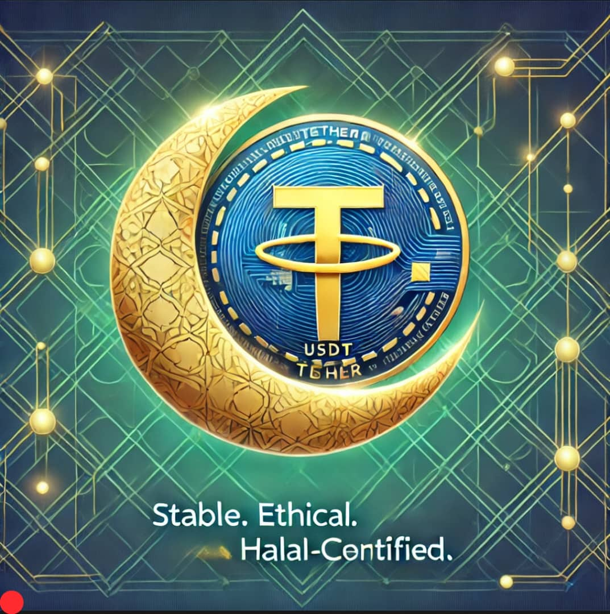
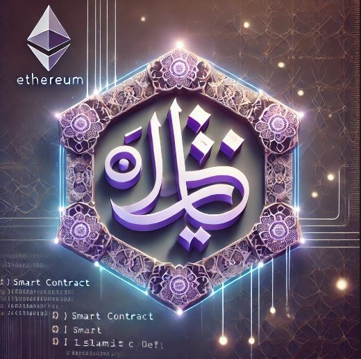
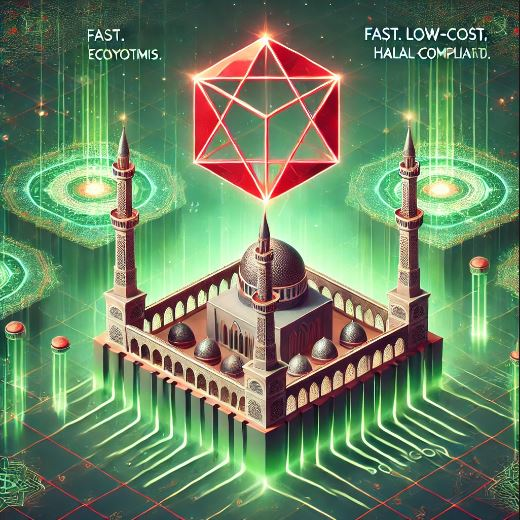
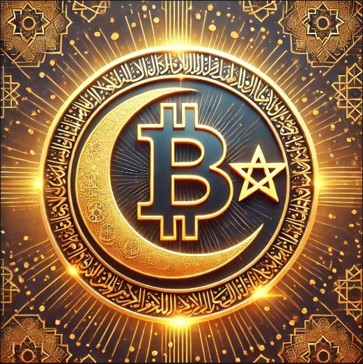

# 💲MyHalal Cryptocurrency

#### **General Design Guidelines**

1. **Islamic/Financial Fusion**: Blend Halal-certified motifs (crescent moons, geometric patterns, mosque silhouettes) with crypto/web3 aesthetics.
2. **Color Palette**: Green (symbolizing Islam and growth), gold (wealth), and blockchain tech accents (e.g., Ethereum’s purple, Bitcoin orange).
3. **Trust & Compliance**: Include Halal certification badges or "Sharia-compliant" labels.

***

#### **1.** 💲**MyHalal/USDT (Tether)**

<figure><figcaption></figcaption></figure>

* **Theme**: _Stability meets ethics_.
* **Visuals**:
  * A golden crescent moon cradling the USDT logo (blue/gold).
  * Background: Green geometric patterns with blockchain node connections.
  * Text: "Stable. Ethical. Halal-Certified."

***

#### **2.** 💲**MyHalal/ETH (Ethereum)**

<figure><figcaption></figcaption></figure>

* **Theme**: _Innovation in Islamic DeFi_.
* **Visuals**:
  * Ethereum’s purple hexagon integrated with Arabic calligraphy (e.g., "حلال").
  * Floating smart contract code snippets in the background.
  * Text: "Decentralized. Transparent. Halal."

***

#### **3.** 💲**MyHalal/MATIC (Polygon)**

<figure><figcaption></figcaption></figure>

* **Theme**: _Scalable Halal ecosystems_.
* **Visuals**:
  * Polygon’s red diamond logo transforming into a mosque minaret.
  * Green blockchain networks radiating from the center.
  * Text: "Fast. Low-Cost. Halal-Compliant."

***

#### **4.** 💲**MyHalal/BTC (Bitcoin)**

<figure><figcaption></figcaption></figure>

* **Theme**: _Halal meets digital gold_.
* **Visuals**:
  * Bitcoin’s orange "₿" merged with a golden Islamic star-and-crescent.
  * Background: Abstract halal-certified meat/food icons digitized into pixels.
  * Text: "Trusted. Global. Halal."

***

#### **Technical Specs for Designers**

* **Format**: PNG with transparent background.
* **Resolution**: 1200x1200px (for social media/exchange listings).
* **Fonts**: Modern sans-serif (e.g., Poppins) + Arabic calligraphy (optional).

***

**Example of Tokenization Process:**

Assuming 💲**MyHalal** is initially priced at 0.01 USD per token in the public sale, the price can fluctuate based on market conditions:

<table data-header-hidden><thead><tr><th width="256">TOKEN PAIR</th><th>PRICE EXAMPLE</th></tr></thead><tbody><tr><td>💲<strong>MyHalal/USDT</strong></td><td>1 💲MyHalal = 0.01 USD</td></tr><tr><td>💲<strong>MyHalal/ETH</strong></td><td>1 💲MyHalal = 0.000003 ETH</td></tr><tr><td>💲<strong>MyHalal/MATIC</strong></td><td>1 💲MyHalal = 0.00015 MATIC</td></tr><tr><td>💲<strong>MyHalal/BTC</strong></td><td>1 💲MyHalal = 0.0000015 BTC</td></tr></tbody></table>

These prices are hypothetical and will change as the market evolves.

***

**Token Use in the HalalChain Ecosystem:**

* **Staking Rewards:** Users who stake 💲**MyHalal** tokens will earn rewards that may be paid in 💲**MyHalal** or other designated cryptocurrencies based on staking pools.
* **Payments:** 💲**MyHalal** can be used to pay for products and services on the HalalChain Marketplace, with the transaction value determined by the current market rate.
* **Governance Participation:** Token holders will use 💲**MyHalal** tokens to vote on key platform decisions, influencing the future development of HalalChain Marketplace.

***
